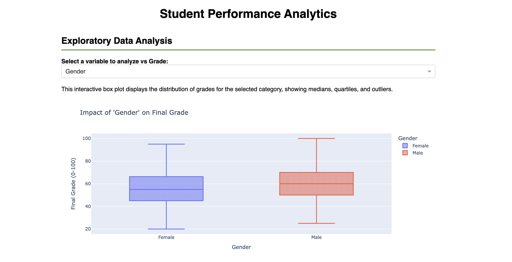
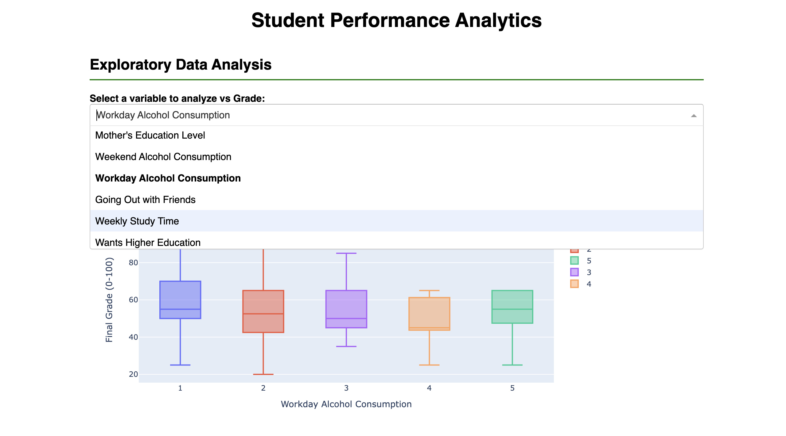
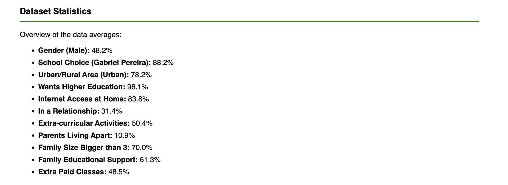
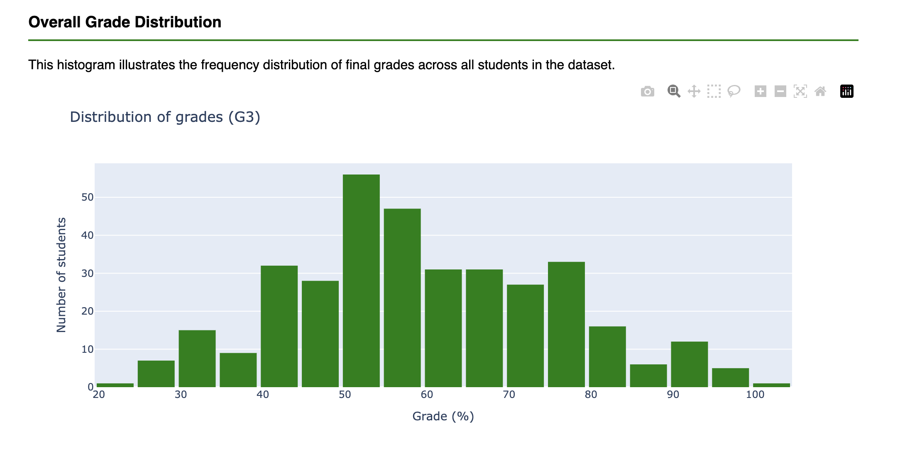
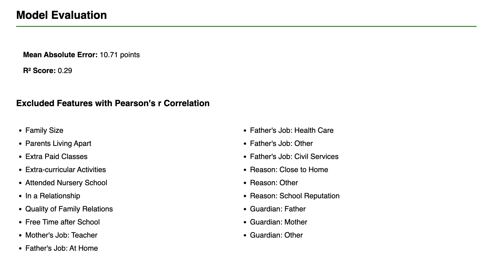
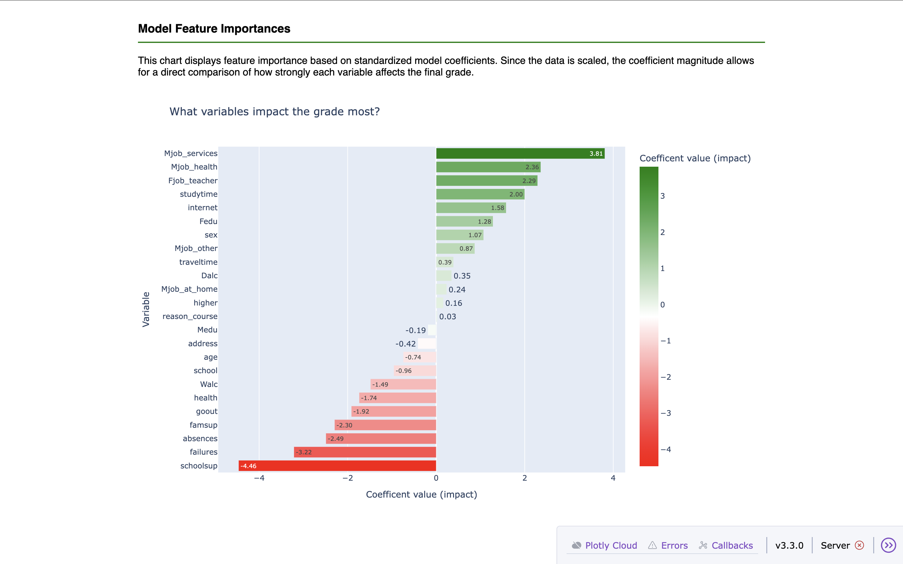
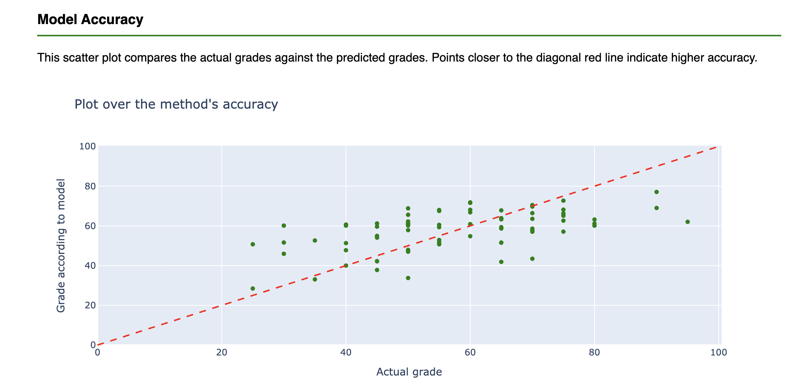
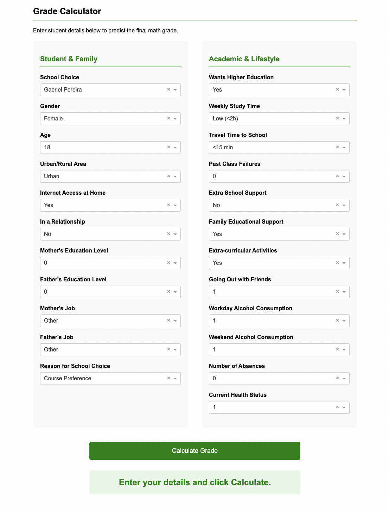
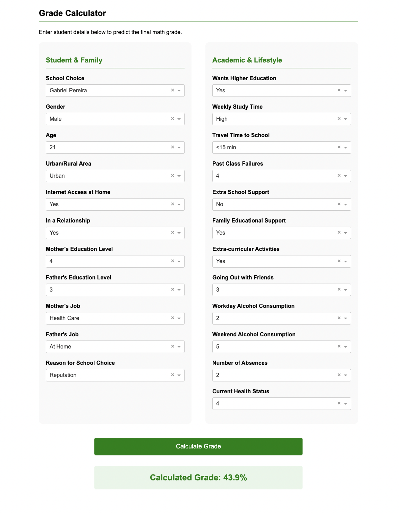

# Student Performance Analytics Dashboard
An interactive web application built to analyze student performance data and predict final math grades. This project was made for the **Lund University Finance Society (LINC) Advanced Python Workshop (HT 25)**.

The project uses **Linear Regression** to identify the most important factors for higher grades in maths and provides a model to estimate student grades based on demographic and lifestyle.

---

## Table of Contents
- [Project Overview](#project-overview)
- [Data Source](#data-source)
- [Methodology and Model Choices](#methodology-and-model-choices)
- [Key Insights and Results](#key-insights-and-results)
- [Screenshots](#screenshots)
- [Installation and Usage](#installation-and-usage)

---


## Project Overview
The goal of this project is to analyze the [UCI Student Performance Dataset](https://archive.ics.uci.edu/ml/datasets/student+performance) and answer the question: **"Can we predict a student's final math grade (G3) based on their background, lifestyle, and study habits, without relying on earlier grades?"** This is done using linear regression and shown in a dashboard.

## Data Source
The dataset used is the **Student Performance Data Set** from the UCI Machine Learning Repository.
* **Source:** [UCI Machine Learning Repository - Student Performance](https://archive.ics.uci.edu/ml/datasets/Student+Performance)
* **Context:** The data attributes include student grades, demographic, social, and school-related features collected from two secondary schools in Portugal.

<details>
<summary><strong>View the full Data Dictionary (Variable Descriptions)</strong></summary>
<br>

| Variable | Description | Type/Range |
| :--- | :--- | :--- |
| **school** | Student's school | Binary: 'GP' (Gabriel Pereira) or 'MS' (Mousinho da Silveira) |
| **sex** | Student's sex | Binary: 'F' (Female) or 'M' (Male) |
| **age** | Student's age | Numeric: 15 to 22 |
| **address** | Home address type | Binary: 'U' (Urban) or 'R' (Rural) |
| **famsize** | Family size | Binary: 'LE3' (≤3) or 'GT3' (>3) |
| **Pstatus** | Parent's cohabitation status | Binary: 'T' (Together) or 'A' (Apart) |
| **Medu** | Mother's education | 0 (None) to 4 (Higher Education) |
| **Fedu** | Father's education | 0 (None) to 4 (Higher Education) |
| **Mjob** | Mother's job | Nominal (teacher, health care, civil services, at home, other) |
| **Fjob** | Father's job | Nominal (teacher, health care, civil services, at home, other) |
| **reason** | Reason to choose this school | Nominal (home, reputation, course, other) |
| **guardian** | Student's guardian | Nominal (mother, father, other) |
| **traveltime** | Home to school travel time | 1 (<15 min) to 4 (>1 hour) |
| **studytime** | Weekly study time | 1 (<2 hours) to 4 (>10 hours) |
| **failures** | Past class failures | Numeric (n if 1≤n<3, else 4) |
| **schoolsup** | Extra educational support | Binary: Yes/No |
| **famsup** | Family educational support | Binary: Yes/No |
| **paid** | Extra paid classes | Binary: Yes/No |
| **activities** | Extra-curricular activities | Binary: Yes/No |
| **nursery** | Attended nursery school | Binary: Yes/No |
| **higher** | Wants to take higher education | Binary: Yes/No |
| **internet** | Internet access at home | Binary: Yes/No |
| **romantic** | With a romantic relationship | Binary: Yes/No |
| **famrel** | Quality of family relationships | 1 (Very Bad) to 5 (Excellent) |
| **freetime** | Free time after school | 1 (Very Low) to 5 (Very High) |
| **goout** | Going out with friends | 1 (Very Low) to 5 (Very High) |
| **Dalc** | Workday alcohol consumption | 1 (Very Low) to 5 (Very High) |
| **Walc** | Weekend alcohol consumption | 1 (Very Low) to 5 (Very High) |
| **health** | Current health status | 1 (Very Bad) to 5 (Very Good) |
| **absences** | Number of school absences | Numeric: 0 to 93 |
| **G1** | First period grade | *Excluded from model* |
| **G2** | Second period grade | *Excluded from model* |
| **G3** | Final grade (Target) | Numeric: 0 to 20 (Scaled to 0-100) |

</details>


## Methodology and Model Choices
To create a strong model for a meaningful analysis, several defining choices were made for the project.

### 1. Data Cleaning and Preprocessing
Raw data processing is handled in `main.py`. The following choices were made:

* **Handling Data:** The original dataset included grades for three periods `G1` (1st period) and `G2` (2nd period) and final grade (`G3`). The choice was made to **remove** `G1` and `G2` because of their very high correlation to `G3`, which would make the analysis boring and not give space for the other, more interesting parameters affecting the final grade.
* **Target Variable Scaling:** The target variable `G3` (originally 0-20) was scaled to a percentage (0-100) to be more intuitive for dashboard users.
* **Filtering:** Students with `G3 = 0` were **removed** as outliers. An unusual amount of students had grade with the value 0, which diverged from the overall trend seen in the **Overall grade Distribution**. In the context of the Portuguese grading system, a grade of 0 typically mean a student who was **absent from the final exam** or dropped out, rather than a student who attempted the exam and demonstrated zero knowledge. Including these values could damage the model and by removing them (34 values) the R2-score was increased by 25.0% and the MAE decreased by 24.9%. 
  
* **Encoding:**
    * Binary variables (e.g., `sex`, `romantic`) were mapped to 0/1.
    * Categorical variables (e.g., `Mjob`, `reason`) were encoded using `pd.get_dummies` to allow the linear model to interpret them correctly.
      
### 2. Feature Selection Strategy
To prevent overfitting and reduce noise, we employed a correlation-based feature selection method:
* **Metric:** Pearson Correlation Coefficient ($r$).
* **Threshold:** Features with an absolute correlation $|r| < 0.06$ with the target variable were excluded. The excluded features are shown in **Model Evaluation** and seem reasonable, e.g `guardian`, `nursery` or `famsize` should not affect the grade in any major way. The threshold was chosen experimentally to maximize the R2-score. Including variables with small correlation introduced noise that worsened model performance on the test set.

### 3. Model Selection
**Linear Regression** was selected as the main model for this project.
* **Justification:** It was chosen for its simplicty and explainability. Linear regression allows us to calculate exact weights for each feature, making it easy to explain to the user exactly how inputs like `Study Time` positively or negatively affect the predicted score.
  
* **Preprocessing:** Since the dataset contains features with very different ranges (for example `absences` ranges from 0 to 93, while `studytime` ranges only from 1 to 4), unscaled linear regression coefficients would be misleading in a comparison. A unit change in "study time" is far more significant than a unit change in "absences". By applying `StandardScaler` ($z = \frac{x - \mu}{\sigma}$) the data is normalized to a mean of 0 and a standard deviation of 1. This ensures that the model coefficients represent the impact of a variable relative to its variance, making the coefficients comparable. This allows us to correctly rank features by importance, as seen in the **Model Feature Importance**.

---
## Key Insights and Results
After training the model and analyzing the feature importance, several interesting patterns and results emerged.

### 1. What matters most? (High Impact Features)
The model identified **Extra educational support (`schoolsup`)** as the single strongest predictor of a student's final grade.
* **Negative Correlation:** There is a strong negative correlation between receiving educational support and the final grade. This is interpreted as a reactive indicator: students are assigned support *because* they are already struggling.
* **Other Negative Factors:** As expected, variables such as past `failures`, high `absences`, and frequent going out (`goout`) negatively impact the grade.
* **Positive Correlation:** Factors providing stability and resources showed positive effects. These include `studytime`, access to `internet`, and having a parent as a teacher (`Fjob_teacher`).
    * *Note:* The model also identified the mother's job (for example in health) as a positive factor. Rather than a coincidence, this likely serves as a result of the family's socioeconomic status and educational background.

### 2. What matters less? (Low Impact Features)
Surprisingly, some factors often assumed to be important showed little to no impact on the final grade in this dataset:
* **Family Structure:** Variables such as family size (`famsize`) and the student's guardian (`guardian`) had negligible coefficients.
* **Weekday Drinking:** Surprisingly, workday alcohol consumption (`Dalc`) showed a slightly positive (or negligible) correlation in this model, contrary to the expected negative impact.
* **Extra Paid Classes:** Spending extra money on paid classes (`paid`) showed no significant effect on the final grade.
* **Free Time:** The amount of reported free time also had surprisingly little impact on performance.

### 3. Reasonability of the Heatmap
By observing the **Correlation Matrix**, several logical relationships confirm the quality of the data. (Note: The heatmap displays selected features to maintain readability).
* **Parental Education:** `Medu` and `Fedu` are highly correlated, indicating that parents often share similar education level.
* **Ambition vs. Failure:** `higher` (wants higher education) and `failures` are negatively correlated, suggesting that students with past failures may lower their ambitions.
* **Gender & Habits:** `sex` and `studytime` show a correlation, indicating gender-based differences in study habits within this datase.
* **Alcohol Consumption:** `Dalc` and `Walc` are highly correlated, meaning students who consume alcohol on weekdays are likely to do so on weekends as well.
* **Socializing & Drinking:** `goout` and `Walc` are positively correlated, linking social activity frequency to weekend alcohol consumption.

### 4. Model Performance
The model achieved an **$R^2$ score of 0.29** and a **MAE (Mean Absolute Error) of 10.71**.
* **Context:** While an $R^2$ of 0.29 might seem low in other contexts, it is a reasonable result in social sciences when predicting complex human behavior only based on demographics.
* **Constraints:**  Itentionally, prior grades (`G1`, `G2`) were excluded to force the model to predict based on background factors rather than past performance. Without these historic data points, the unexplained variance is naturally higher.
* **Qualitative Validation:** The model aligns well with intuition, making logically sound predictions. It correctly identifies **absence** and **past failures** as significant negative drivers, while identifing positive factors such as **study time**, **parents' education**, and **moderated alcohol consumption**.
* **Conclusion:** The model successfully captures broad trends such as the negative impact of absences and the positive impact of study environment, but individual student performance inevitably involves personal factors not captured in this dataset.
---

## Screenshots

### 1. Exploratory Data Analysis (EDA) and Statistics
*Overview of the interactive dashboard, variable exploration, and dataset statistics.*






### 2. Model Evaluation & Insights
*Visualizations showing model accuracy, feature importance, and correlation matrices.*






### 3. Grade Prediction Calculator
*The interactive tool where users input student data to receive a predicted grade.*





## Installation and Usage
To run this application follow these steps:

1. **Clone the repository:**
   ```bash
   git clone [https://github.com/alexanderlars/advanced_python_continuation_project.git](https://github.com/alexanderlars/advanced_python_continuation_project.git)
   cd advanced_python_continuation_project
 
2.**Install dependencies:**
Make sure you have the required libraries installed.
```bash
pip install -r requirements.txt
```
3.**Run the application:**

```bash
python app.py
```


---
### Author
**Alexander Larsnäs**

*Project created for the Linc Advanced Python Workshop (HT 25).*

